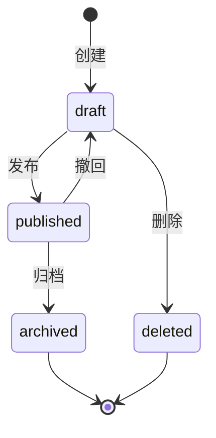

# 资源建模方法

## 概览

资源建模是 API 设计的基石。本文档覆盖：资源抽取方法 → 动作模型设计 → 状态转换设计 → 资源边界判断。

---

## 资源抽取方法

### 名词法：从需求中提取资源

**步骤**：
1. 收集所有需求文档（PRD、业务流程、用例说明）
2. 标记所有业务名词（去除 UI 概念、操作动词、修饰词）
3. 过滤噪声名词：
   - ❌ UI 概念：弹窗、面板、选项卡、标签页
   - ❌ 派生数据：统计数、汇总值（应通过查询计算）
   - ❌ 临时状态：加载中、编辑模式
4. 合并同义词（如"课程"和"教程"指同一资源）
5. 输出候选资源清单

**候选资源评估模板**：

| 候选名词 | 有独立生命周期？ | 需独立 CRUD？ | 有唯一标识？ | 结论 |
|---------|--------------|-------------|------------|------|
| {名词} | 是/否 | 是/否 | 是/否 | 资源 / 属性 / 排除 |

### 动词法：从操作中发现隐含资源

**步骤**：
1. 收集所有业务操作（动词短语）
2. 分析每个操作的主体和客体
3. 当一个操作不能归入已有资源的 CRUD 时 → 可能有隐含资源

**示例**：

| 业务操作 | 主体 | 客体 | 归属资源 | 备注 |
|---------|------|------|---------|------|
| 提交作业 | 学生 | 作业 | Submission | 独立资源，不是 Assignment 的状态变更 |
| 给作业评分 | 教师 | 提交记录 | Grade | 独立资源 or Submission 的动作？需判断 |
| 请假 | 学生/家长 | 考勤 | LeaveRequest | 独立资源 |

---

## 动作模型设计

### CRUD 资源 vs 过程性动作

| 类型 | 特征 | HTTP 映射 | 示例 |
|------|------|----------|------|
| **CRUD 资源** | 有独立生命周期、可持久化、有 ID | 标准 RESTful | 课程、学生、作业 |
| **过程性动作** | 无独立实体、是对资源的操作 | POST /{resource}/{id}/actions/{action} | 发布课程、提交作业、审批请假 |
| **复合操作** | 涉及多个资源的编排 | POST /operations/{operation} 或拆分为多步 | 批量排课、学期初始化 |

### HTTP Method 语义映射

| Method | 语义 | 幂等 | 安全 | 使用场景 |
|--------|------|------|------|---------|
| GET | 读取 | ✅ | ✅ | 查询列表/详情/搜索 |
| POST | 创建/执行动作 | ❌ | ❌ | 创建资源、触发过程性动作 |
| PUT | 全量替换 | ✅ | ❌ | 整体更新（客户端发送完整资源） |
| PATCH | 部分更新 | ❌* | ❌ | 局部更新（只发送变更字段） |
| DELETE | 删除 | ✅ | ❌ | 删除资源（软删除或硬删除） |

> *PATCH 可通过幂等键实现幂等

### 动作端点设计规范

当业务操作不适合映射为 CRUD 时，使用动作端点：

```
POST /{resource}/{id}/actions/{action_name}
```

**适用场景**：
- 状态转换：`POST /orders/{id}/actions/cancel`
- 触发流程：`POST /assignments/{id}/actions/publish`
- 批量操作：`POST /students/actions/batch-import`

**不适用场景**（应使用标准 CRUD）：
- 简单的字段更新 → 用 PUT/PATCH
- 创建子资源 → 用 POST /{parent}/{id}/{child}

---

## 状态转换设计

### 状态机建模步骤

1. **列举所有状态**：从需求中提取资��的所有可能状态
2. **定义合法转换**：哪些状态可以转到哪些状态
3. **标注转换触发条件**：谁、什么操作、什么前提条件
4. **识别终态**：到达后不可逆转的状态

### 状态转换矩阵模板

| 当前状态 | 目标状态 | 触发动作 | 触发角色 | 前提条件 | API 端点 |
|---------|---------|---------|---------|---------|---------|
| draft | published | 发布 | teacher | 内容完整 | POST /courses/{id}/actions/publish |
| published | archived | 归档 | admin | 无进行中学生 | POST /courses/{id}/actions/archive |
| draft | deleted | 删除 | teacher | 无关联数据 | DELETE /courses/{id} |

### 状态转换 Mermaid 模板



---

## 资源边界判断

### 核心原则

一个资源 = 一个明确的业务职责。如果一句话说不清一个资源是什么，它需要拆分。

### 边界判断检查表

| 检查项 | 通过条件 |
|--------|---------|
| **职责单一** | 一句话说清这个资源管什么，不用"和" |
| **独立生命周期** | 资源有自己的创建→使用→归档/删除周期 |
| **独立标识** | 资源有唯一 ID，不依赖其他资源 ID 才能存在 |
| **消费方独立** | 至少有一个消费��景不依赖其他资源 |
| **变更频率一致** | 资源内的字段变更频率相近 |

### 资源拆分信号

出现以下情况时考虑拆分：

- 一个资源有两组完全不同生命周期的字段
- 一个端点返回的数据中有大段"可能为 null"的区块
- 前端在不同页面使用同一资源的完全不同字段子集
- 不同角色对同一资源有完全不同的读写权限粒度

### 资源层级设计

```
/{parent}                          # 顶层资源
/{parent}/{id}/{child}             # 从属资源（生命周期依赖父资源）
/{resource}?{parent}_id={id}       # 关联资源（独立生命周期，通过参数过滤）
```

**选择标准**：

| 场景 | 设计方式 | 示例 |
|------|---------|------|
| 子资源不能独立于父资源存在 | 嵌套路径 | /courses/{id}/chapters |
| 资源有独立生命周期但有关联 | 查询参数 | /assignments?course_id=xxx |
| M:N 关系 | 独立关联资源 | /enrollments（学生×课程） |

---

## 资源清单输出模板

```markdown
## 资源清单

| 资源 | 英文名 | 业务含义 | 层级 | 主要动作 | 状态 |
|------|--------|---------|------|---------|------|
| 课程 | Course | 教学内容单元 | 顶层 | CRUD + publish/archive | draft→published→archived |
| 章节 | Chapter | 课程下的内容单元 | Course 子资源 | CRUD + reorder | active |
| 作业 | Assignment | 教学评估单元 | 关联 Course | CRUD + publish | draft→published→closed |
```
