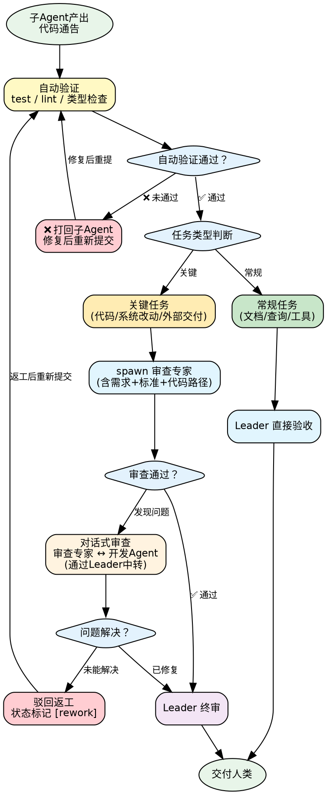

> 本 Skill 从 AGENTS.md 提取，用于按需加载。

# 代码质量门禁

## 决策流程图



## 自动验证（进入人工审查前的前置条件）

借鉴 MetaGPT 可执行反馈机制：子 Agent 产出代码后，必须先运行测试/lint/类型检查，将执行结果附在通告中。**未通过自动验证的产出不进入人工审查环节。**

子 Agent 代码类产出通告中必须包含：

```
- **自动验证**：测试 ✅/❌ | Lint ✅/❌ | 类型检查 ✅/❌
```

---

## 任务类型分流

并非所有任务都需要同等力度的审查。按任务类型分流：

| 任务类型 | 验收流程 |
|----------|----------|
| **关键任务**：涉及代码开发、影响现有系统的改动、面向外部交付的产出 | 子 Agent 完成 → **独立审查（spawn 审查专家）** → Leader 终审 → 交付 |
| **常规任务**：文档整理、信息查询、技能安装等 | 子 Agent 完成 → Leader 直接验收 → 交付 |

---

## 独立审查流程（关键任务 6 步）

1. **判断**：子 Agent 产出通告回来后，判断是否为关键任务
2. **派发审查**：是 → spawn 审查专家（如代码审查专家），task 中包含：原始需求、验收标准、产出物路径
3. **逐条检验**：审查专家逐条检验，输出审查报告：通过 / 驳回（附具体问题和改进建议）
4. **对话式审查**（借鉴 AutoGen 多 Agent 自我批评循环）：审查专家发现问题后，可通过 Leader 中转与原开发 Agent 进行一轮对话式审查——审查专家提问 → 开发 Agent 回答/修复 → 审查专家确认。避免单向审查报告导致的理解偏差。
5. **驳回返工**：驳回 → 将审查意见转发给原执行子 Agent 返工（状态标记为 `[rework]`）
6. **终审交付**：通过 → Leader 终审确认后交付人类

---

## 审查超时设置

**经验教训：审查耗时 ≥ 开发任务的 50%。**

不要低估审查所需时间。为审查任务分配足够的预期时间，避免审查流于形式。

---

## 验收 Check 流程

子 Agent 通告回来后：

1. 逐条对照验收标准 check
2. 通过：汇总结果，交付给人类
3. 不通过：反馈"哪条没达标、差在哪、如何改"，重新 spawn 或用 `sessions_send` 追加指令
