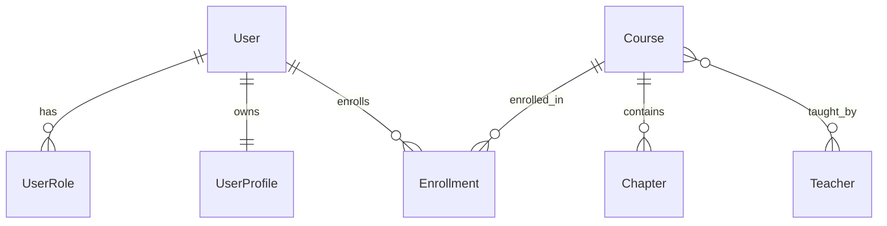

# 实体建模方法

## 目录

- [实体抽取方法](#实体抽取方法)
- [聚合边界识别](#聚合边界识别)
- [概念模型设计](#概念模型设计)
- [关系建模](#关系建模)

---

## 实体抽取方法

### 名词法（主要方法）

从 PRD/需求文档中提取所有业务名词，逐一判断：

**提取步骤**：
1. 扫描需求文档，标记所有名词和名词短语
2. 按以下分类表过滤：

| 类别 | 判断标准 | 处理 | 示例 |
|------|---------|------|------|
| **核心实体** | 有独立生命周期、可被增删改查 | ✅ 保留 | 用户、订单、课程 |
| **值对象** | 依附实体存在，无独立 ID | ✅ 保留为属性组 | 地址、联系方式 |
| **UI 概念** | 只存在于页面展示 | ❌ 排除 | "卡片"、"弹窗"、"选项卡" |
| **派生数据** | 可通过计算得到 | ❌ 排除 | "总金额"、"完成率" |
| **临时状态** | 运行时状态，不持久化 | ❌ 排除 | "加载中"、"已选中" |
| **外部系统** | 不在本系统持久化 | ⚠️ 标记外部引用 | "微信用户"、"支付网关" |

3. 对保留的实体检查唯一性（同一概念是否有多个叫法）

### 动词法（补充方法）

从业务流程中提取动作，反推实体：

| 业务动作 | 反推问题 | 可能的实体 |
|---------|---------|-----------|
| "提交作业" | 谁提交？提交什么？交给谁？ | 学生、作业、教师 |
| "审批订单" | 谁审批？审批什么？基于什么？ | 审批人、订单、审批记录 |
| "分配班级" | 分配谁？到哪里？谁操作？ | 学生、班级、分配记录 |

### 实体验证四问

每个候选实体必须通过：

1. **有独立 ID 吗？** — 没有 → 可能是值对象或属性
2. **有独立生命周期吗？** — 创建/修改/删除路径独立 → 是实体
3. **多个地方引用它吗？** — 只在一处出现 → 可能是嵌套属性
4. **一句话能说清它的职责吗？** — 说不清 → 需要拆分

---

## 聚合边界识别

### 聚合的核心概念

- **聚合根**：聚合的入口实体，外部只通过聚合根访问内部实体
- **聚合边界**：一组必须保持一致性的实体的边界
- **不变量**：聚合内必须始终满足的业务规则

### 聚合划分三步法

**Step 1：找不变量**
- 哪些实体之间有"必须同时成立"的业务规则？
- 违反规则的后果是什么？（越严重 → 越需要在同一聚合）

**Step 2：确定聚合根**
- 外部访问这组实体时，通过谁进入？
- 谁控制内部实体的创建和删除？

**Step 3：验证边界**

| 检验 | 通过条件 |
|------|---------|
| **事务边界** | 聚合内操作可在单事务完成 |
| **独立可加载** | 加载聚合根时，能一次加载完所有内部实体 |
| **大小合理** | 聚合不超过 5-7 个实体（过大需拆分） |
| **跨聚合引用** | 只通过 ID 引用，不直接嵌套 |

### 聚合边界错误信号

| 信号 | 可能的问题 | 处理 |
|------|-----------|------|
| 聚合内实体 > 7 | 聚合太大 | 拆分子聚合 |
| 跨聚合要事务一致 | 边界划错 | 重新评估不变量 |
| 聚合根有 30+ 字段 | 承载了多个职责 | 考虑拆分 |
| 修改 A 总要改 B | A、B 可能该在同一聚合 | 合并评估 |

---

## 概念模型设计

### 概念模型的定义

概念模型只回答三个问题：
1. **有哪些实体？**（名字 + 一句话含义）
2. **实体间什么关系？**（1:1、1:N、M:N）
3. **聚合边界在哪？**（哪些实体一起管理）

**不包含**：字段、类型、约束、索引 —— 这些属于逻辑/物理层。

### 概念模型输出格式

使用 Mermaid erDiagram：

### 概念模型覆盖度检查

完成概念模型后，用核心业务场景验证：

1. 列出所有核心业务场景（来自 PRD）
2. 逐场景检查：涉及的实体是否都在模型中？
3. 场景中的关系是否与模型一致？
4. 有无遗漏实体（场景需要但模型中没有）？

---

## 关系建模

### 关系类型判断

| 关系 | 判断依据 | 映射方式 |
|------|---------|---------|
| **1:1** | A 和 B 严格一一对应 | 同表（属性组）或分表 + FK |
| **1:N** | A 有多个 B，B 只属于一个 A | B 表加 A 的 FK |
| **M:N** | A 和 B 互相有多个 | 中间表 |

### 1:1 关系的拆分判断

1:1 关系默认放同一张表，以下情况考虑拆分：

| 拆分理由 | 示例 |
|---------|------|
| 访问频率差异大 | 用户基本信息（高频） vs 用户扩展资料（低频） |
| 字段数量太多 | 合在一起超过 30 个字段 |
| 权限隔离 | 敏感信息需要独立访问控制 |
| 变更频率不同 | 配置信息频繁变更 vs 基础信息稳定 |

### M:N 中间表设计要点

中间表不是"纯连接表"，关注：

1. **是否携带属性？** — 如"学生选课"中间表可能有"选课时间"、"成绩"
2. **是否有独立生命周期？** — 创建/修改/删除路径独立 → 是实体
3. **唯一约束** — 通常两个 FK 组合唯一
4. **是否需要审计字段？** — 关系的建立和解除是否需要追踪

### 关系方向判断

| 问题 | 确定方向 |
|------|---------|
| 谁依赖谁存在？ | 依赖方持有 FK |
| 删除 A 时 B 怎么办？ | CASCADE / RESTRICT / SET NULL |
| 谁先创建？ | 被引用方先创建 |

### 关系建模陷阱

| 陷阱 | ❌ 错误 | ✅ 正确 |
|------|--------|--------|
| 循环外键 | A→B→C→A | 打断一环，用应用层保证 |
| 隐式关系 | 用 JSON 字段存关联 ID 列表 | 显式外键或中间表 |
| 过度关联 | 每对实体都建关系 | 只建有业务意义的关系 |
