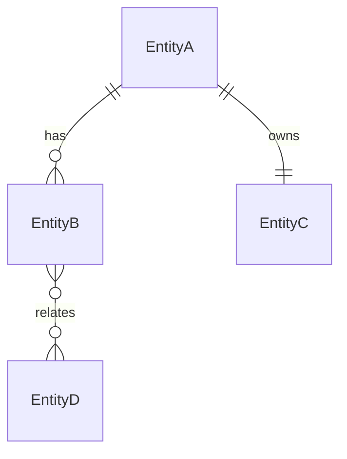

# 数据模型交付包模板

## 概览

数据模型交付包包含 7 个标准文档：

```
{project}/database/
├── domain-model.md               # 领域概念模型
├── logical-data-model.md         # 逻辑数据模型
├── physical-schema.sql           # 物理表结构（DDL）
├── field-dictionary.md           # 字段字典
├── constraint-and-index-plan.md  # 约束与索引方案
├── schema-migration-plan.md      # 迁移方案
└── data-risk-report.md           # 数据风险报告
```

---

## 1. domain-model.md 模板

```markdown
# 领域概念模型

## 项目信息
- **项目名称**：
- **版本**：v{x.y}
- **日期**：{YYYY-MM-DD}
- **建模负责人**：

## 业务目标摘要
{一段话说清产品要解决什么问题，涉及哪些核心业务域}

## 核心实体清单

| 实体 | 业务含义 | 聚合 | 生命周期 |
|------|---------|------|---------|
| {实体名} | {一句话业务含义} | {所属聚合} | {创建→活跃→归档/删除} |

## 聚合划分

### 聚合 1：{聚合名}
- **聚合根**：{实体名}
- **包含实体**：{列表}
- **业务规则**：{聚合内不变量}
- **边界理由**：{为什么这些实体在一个聚合}

### 聚合 2：{聚合名}
（同上格式）

## 实体关系图

{用 Mermaid erDiagram 或文字描述}



## 关键业务规则

| # | 规则 | 影响实体 | 约束类型 |
|---|------|---------|---------|
| 1 | {规则描述} | {实体名} | {唯一/非空/状态转换/跨实体} |

## 概念模型覆盖度检查

| 业务场景 | 涉及实体 | 是否覆盖 |
|---------|---------|---------|
| {场景名} | {实体列表} | ✅/❌ |

## 待确认项
- [ ] {需要上游确认的业务问题}
```

---

## 2. logical-data-model.md 模板

```markdown
# 逻辑数据模型

## 项目信息
- **项目名称**：
- **版本**：v{x.y}
- **日期**：{YYYY-MM-DD}
- **规范化级别**：{3NF / 2NF + 理由}

## 实体属性定义

### {实体名}

| 属性 | 语义 | 必填 | 唯一 | 关系 | 备注 |
|------|------|------|------|------|------|
| id | 主标识 | ✅ | ✅ | PK | |
| {attr} | {含义} | ✅/❌ | ✅/❌ | {FK→表.字段} | |

### {实体名2}
（同上格式）

## 关系映射

| 关系 | 类型 | 映射方式 | 说明 |
|------|------|---------|------|
| EntityA → EntityB | 1:N | EntityB.entity_a_id FK | |
| EntityC ↔ EntityD | M:N | 中间表 entity_c_d | |

## 中间表设计（M:N 关系）

### {中间表名}

| 属性 | 语义 | 约束 |
|------|------|------|
| entity_a_id | 引用 A | FK + PK(组合) |
| entity_b_id | 引用 B | FK + PK(组合) |
| {额外属性} | {关系属性} | |

## 规范化决策

| 决策 | 当前级别 | 理由 | 降级风险 |
|------|---------|------|---------|
| {哪个实体/属性} | {2NF/3NF} | {为什么} | {数据不一致风险说明} |

## 待确认项
- [ ] {需要确认的逻辑模型问题}
```

---

## 3. physical-schema.sql 模板

```sql
-- ============================================
-- 物理表结构
-- 项目：{project_name}
-- 版本：v{x.y}
-- 日期：{YYYY-MM-DD}
-- 数据库：{PostgreSQL / MySQL / SQLite}
-- ============================================

-- ---------- 聚合 1：{聚合名} ----------

CREATE TABLE {table_name} (
    -- 主键
    id              {BIGINT AUTO_INCREMENT / UUID}  NOT NULL,

    -- 业务字段
    {column_name}   {TYPE}          {NOT NULL / NULL}   {DEFAULT value},

    -- 外键引用
    {fk_column}     {TYPE}          NOT NULL,

    -- 状态与生命周期
    status          VARCHAR(32)     NOT NULL            DEFAULT 'draft',

    -- 审计字段
    created_at      TIMESTAMP       NOT NULL            DEFAULT CURRENT_TIMESTAMP,
    updated_at      TIMESTAMP       NOT NULL            DEFAULT CURRENT_TIMESTAMP,
    created_by      VARCHAR(64)     NOT NULL,
    updated_by      VARCHAR(64)     NOT NULL,

    -- 软删除
    is_deleted      BOOLEAN         NOT NULL            DEFAULT FALSE,
    deleted_at      TIMESTAMP       NULL,

    -- 约束
    CONSTRAINT pk_{table}           PRIMARY KEY (id),
    CONSTRAINT fk_{table}_{ref}     FOREIGN KEY ({fk_column}) REFERENCES {ref_table}(id),
    CONSTRAINT uk_{table}_{col}     UNIQUE ({unique_columns}),
    CONSTRAINT ck_{table}_status    CHECK (status IN ('draft', 'active', 'archived'))
);

-- 索引
CREATE INDEX idx_{table}_{col}      ON {table_name} ({column}) WHERE is_deleted = FALSE;

-- 注释
COMMENT ON TABLE {table_name}       IS '{表的业务含义}';
COMMENT ON COLUMN {table_name}.{col} IS '{字段含义}';
```

---

## 4. field-dictionary.md 模板

```markdown
# 字段字典

## 项目信息
- **项目名称**：
- **版本**：v{x.y}
- **日期**：{YYYY-MM-DD}
- **总表数**：{N}
- **总字段数**：{M}

## {table_name} — {表中文名}

| # | 字段名 | 类型 | 必填 | 默认值 | 含义 | 约束 | 示例值 |
|---|--------|------|------|--------|------|------|--------|
| 1 | id | BIGINT | ✅ | AUTO | 主键标识 | PK | 1001 |
| 2 | name | VARCHAR(128) | ✅ | — | 名称 | NOT NULL | "示例名称" |
| 3 | status | VARCHAR(32) | ✅ | 'draft' | 状态 | CHECK | "active" |
| 4 | created_at | TIMESTAMP | ✅ | NOW() | 创建时间 | — | 2026-01-01T00:00:00 |

## 枚举值定义

### status（{表名}）

| 值 | 含义 | 可转换到 |
|----|------|---------|
| draft | 草稿 | active |
| active | 活跃 | archived |
| archived | 已归档 | — |

## 公共字段说明

以下字段在所有表中统一定义：

| 字段名 | 类型 | 含义 | 说明 |
|--------|------|------|------|
| created_at | TIMESTAMP | 创建时间 | 自动填充，不可修改 |
| updated_at | TIMESTAMP | 最后更新时间 | 每次写入自动更新 |
| created_by | VARCHAR(64) | 创建人 | 存用户 ID |
| updated_by | VARCHAR(64) | 最后更新人 | 存用户 ID |
| is_deleted | BOOLEAN | 软删除标记 | 默认 FALSE |
| deleted_at | TIMESTAMP | 删除时间 | 软删除时填充 |
```

---

## 5. constraint-and-index-plan.md 模板

```markdown
# 约束与索引方案

## 项目信息
- **项目名称**：
- **版本**：v{x.y}
- **日期**：{YYYY-MM-DD}

## 主键策略

| 表 | 主键类型 | 策略 | 理由 |
|----|---------|------|------|
| {table} | {自增 / UUID / 复合} | {说明} | {为什么选这个} |

## 外键策略

| 外键 | 源表.列 | 目标表.列 | ON DELETE | 说明 |
|------|---------|----------|-----------|------|
| fk_{name} | {src.col} | {tgt.col} | {CASCADE/RESTRICT/SET NULL} | |

## 唯一约束

| 约束名 | 表 | 列 | 业务含义 |
|--------|----|----|---------|
| uk_{name} | {table} | {columns} | {为什么唯一} |

## CHECK 约束

| 约束名 | 表 | 表达式 | 业务含义 |
|--------|----|---------| ---------|
| ck_{name} | {table} | {expression} | {约束什么} |

## 索引方案

| 索引名 | 表 | 列 | 类型 | 查询场景 | 条件 |
|--------|----|----|------|---------|------|
| idx_{name} | {table} | {columns} | {B-Tree/Hash/GIN/GiST} | {支撑什么查询} | {WHERE 条件，如 is_deleted=FALSE} |

## 索引评估

| 索引 | 预估读频率 | 预估写频率 | 收益判断 |
|------|----------|----------|---------|
| idx_{name} | {高/中/低} | {高/中/低} | {值得/观察/暂不建} |

## 约束完整性检查

| # | 检查项 | 状态 |
|---|--------|------|
| 1 | 每个表有主键 | ✅/❌ |
| 2 | 外键关系完整 | ✅/❌ |
| 3 | 业务唯一性有约束 | ✅/❌ |
| 4 | 状态字段有 CHECK | ✅/❌ |
| 5 | 核心查询有索引 | ✅/❌ |
| 6 | 无冗余索引 | ✅/❌ |
```

---

## 6. schema-migration-plan.md 模板

```markdown
# Schema 迁移方案

## 项目信息
- **项目名称**：
- **版本**：{from_version} → {to_version}
- **日期**：{YYYY-MM-DD}
- **风险等级**：{低 / 中 / 高}

## 变更摘要

| # | 变更类型 | 对象 | 描述 | 兼容性 |
|---|---------|------|------|--------|
| 1 | {新增表/新增列/修改类型/删除列/重命名} | {table.column} | {具体变更} | {向前兼容/不兼容} |

## 迁移步骤

### Phase 1：准备（可回滚）
```sql
-- Step 1: 新增列（宽松约束）
ALTER TABLE {table} ADD COLUMN {col} {TYPE} NULL;

-- Step 2: 数据回填
UPDATE {table} SET {col} = {expression} WHERE {col} IS NULL;
```

### Phase 2：收紧（需确认数据就绪）
```sql
-- Step 3: 加约束
ALTER TABLE {table} ALTER COLUMN {col} SET NOT NULL;
ALTER TABLE {table} ADD CONSTRAINT {name} {constraint};
```

### Phase 3：清理（不可回滚，延迟执行）
```sql
-- Step 4: 删除旧列（确认无依赖后执行）
ALTER TABLE {table} DROP COLUMN {old_col};
```

## 回滚方案

| Phase | 回滚方式 | 数据影响 |
|-------|---------|---------|
| Phase 1 | DROP COLUMN | 无数据损失 |
| Phase 2 | DROP CONSTRAINT | 放宽约束 |
| Phase 3 | ⚠️ 不可回滚 | 需从备份恢复 |

## 影响评估

| 影响项 | 说明 |
|--------|------|
| 停机窗口 | {是否需要/预估时长} |
| 数据回填 | {数据量/预估耗时} |
| 依赖服务 | {哪些服务受影响} |
| 测试要求 | {需要验证什么} |

## 检查清单

- [ ] 迁移脚本已在测试环境验证
- [ ] 回滚脚本已在测试环境验证
- [ ] 数据回填脚本幂等
- [ ] 依赖服务已通知
- [ ] 监控告警已调整
```

---

## 7. data-risk-report.md 模板

```markdown
# 数据风险报告

## 项目信息
- **项目名称**：
- **版本**：v{x.y}
- **日期**：{YYYY-MM-DD}
- **整体风险等级**：{低 / 中 / 高}

## 风险汇总

| # | 风险 | 等级 | 影响 | 缓解措施 | 状态 |
|---|------|------|------|---------|------|
| 1 | {风险描述} | {高/中/低} | {影响说明} | {怎么缓解} | {已缓解/待处理/已接受} |

## 模型风险

### 实体边界风险
{哪些实体的边界可能不清晰，为什么，建议怎么处理}

### 字段语义风险
{哪些字段的含义可能在不同上下文有歧义}

### 规范化风险
{哪些地方做了反规范化，数据一致性如何保障}

## 演进风险

### 短期（3个月内）
{已知的 schema 变更需求和风险}

### 中期（3-12个月）
{预见的扩展需求和可能的结构变更}

### 长期
{架构级变更风险（分库分表/换存储引擎等）}

## 一致性风险

### 跨表一致性
| 风险点 | 涉及表 | 风险说明 | 缓解方式 |
|--------|--------|---------|---------|
| {描述} | {表名} | {可能不一致的场景} | {事务/最终一致/补偿} |

### 跨系统一致性
{与外部系统的数据同步风险}

## 迁移风险
{当前 schema 变更的迁移风险，引用 migration-plan}

## 待决事项
- [ ] {需要决策的风险问题}
```

---

## 轻量版模板（快速建模深度使用）

快速建模场景不需要完整 7 文档，输出以下精简版：

```markdown
# {项目} 数据模型快速评估

## 业务目标
{一段话}

## 核心实体

| 实体 | 含义 | 关键属性 | 关系 |
|------|------|---------|------|
| | | | |

## 实体关系
{Mermaid erDiagram 或文字描述}

## 关键约束
{列出核心约束和索引建议}

## 风险提示
- {Top 3 风险}

## 下一步建议
- {是否需要进入标准设计深度}
```
