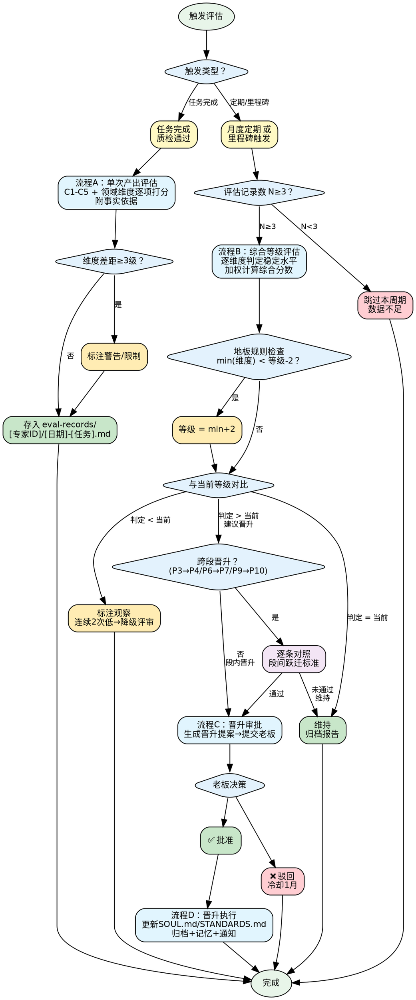

# 专家等级评估与晋升

## 决策流程图



## 概览

P0-P12 共 13 级，四段式结构：初级（P0-P3 执行者）→ 中级（P4-P6 解决者）→ 高级（P7-P9 引领者）→ 大师级（P10-P12 奠基者）。

评估基于 **产出物**，不基于能力感知。所有证据来自外部记录，不依赖专家自我汇报。

## 评估维度与权重

**通用维度（70%）**：

| 维度 | 权重 | 量什么 |
|------|------|--------|
| C1 产出完整度 | 20% | 交付物覆盖了多少该覆盖的 |
| C2 复杂度承接 | 15% | 能独立处理多复杂的任务 |
| C3 决策质量 | 15% | 自主选择是否合理、有据 |
| C4 可消费性 | 10% | 下游能否直接使用 |
| C5 影响力半径 | 10% | 产出的价值辐射范围 |

**领域专属维度（30%）**：每个领域 1-2 个维度，定义在各专家的领域标准卡片中。无卡片时通用维度权重归一化到 100%。

> 📖 各维度 P0-P12 分级标准详见 [references/competency-model.md](references/competency-model.md)
> 📖 P0-P12 等级定义与段间跃迁标准详见 [references/level-framework.md](references/level-framework.md)

---

## 核心流程

### 流程 A：单次产出评估记录

**时机**：每次任务完成、质量检查通过后同步执行。

**步骤**：
1. 对照通用维度 C1-C5 分级标准，逐维度判定本次表现等级（P0-P12）
2. 对照该专家的领域专属维度分级标准打分（无卡片则跳过）
3. 每条判定附 ≤50 字事实依据（不用形容词）
4. 检查短板：维度间差距 ≥3 级标注警告，≥4 级标注限制
5. 按模板填写，存入 `projects/expert-leveling/eval-records/[专家英文ID]/[YYYY-MM-DD]-[任务简称].md`

> 📋 单次评估记录模板见 [references/evaluation-templates.md § 单次评估记录模板](references/evaluation-templates.md)

### 流程 B：综合等级评估

**触发条件**（满足任一）：
- **定期评审**：每月最后一周，当月 ≥3 次产出记录的专家
- **里程碑触发**：① 单项目完成 ≥3 个关键任务；② 首次承接跨段复杂度任务且通过质检；③ 产出被 ≥2 个其他专家/项目引用

**步骤**：

1. **收集记录** — 读取该专家评估周期内所有单次评估记录，统计数 N（N<3 定期评审跳过，N<1 终止）
2. **逐维度判定稳定水平** — 对 C1-C5 + 领域维度：
   - N ≥ 5：最近 5 次中 ≥3 次达到 = 稳定
   - N = 3-4：≥60% 达到 = 稳定
   - N = 1-2：按实际打分，标注"数据不足"
3. **计算综合分数**：
   ```
   综合分数 = C1×0.20 + C2×0.15 + C3×0.15 + C4×0.10 + C5×0.10 + 领域加权分
   ```
   - 1 个领域维度：D1×0.30
   - 2 个领域维度：D1×权重 + D2×权重（之和=0.30）
   - 无领域标准：各维度分数 ÷ 0.70
4. **确定等级** — 综合分数向下取整
5. **地板规则检查** — min(全部维度) < 等级-2 时，等级 = min+2
6. **与当前等级对比**：
   - 判定 > 当前 → **建议晋升**，进入流程 C
   - 判定 = 当前 → **维持**，归档
   - 判定 < 当前 → **标注观察**（连续 2 次低于则启动降级评审）
7. **跨段晋升额外检查**（P3→P4, P6→P7, P9→P10）— 必须逐条对照段间跃迁标准验证
8. 按模板生成评估报告，存入 `eval-records/[专家英文ID]/[YYYY-MM]-summary.md`

> 📋 汇总评估报告模板见 [references/evaluation-templates.md § 汇总评估报告模板](references/evaluation-templates.md)
> 📖 段间跃迁标准见 [references/level-framework.md § 段间跃迁标准](references/level-framework.md)

### 流程 C：晋升审批

1. **生成晋升提案** — 按模板填写（≤500 字），用老板能理解的语言
2. **提交老板** — 私聊发送
3. **老板决策**：
   - ✅ 批准 → 执行晋升（流程 D）
   - ❌ 驳回 → 记录理由，冷却 1 个月，存入 `rejected/`
   - 🟡 追问 → 补充后重新提交

**限制规则**：
- 单次最多晋升 1 级（段内）或 1 级跨段，不允许跳 ≥2 级
- 晋升后需积累 ≥3 次新等级评估记录才可再次触发晋升

> 📋 晋升提案模板见 [references/evaluation-templates.md § 晋升提案模板](references/evaluation-templates.md)

### 流程 D：晋升执行（设定进化）

晋升批准后，派发设定进化任务给角色创造专家：

1. **更新 SOUL.md** — 标题加等级标识 `[P?]`，元数据区块更新，按段位调整身份/信条/性格/风格
2. **更新 STANDARDS.md**（跨段时必须）— 标准提升、新增能力域、边界调整
3. **归档** — 存入 `promotions/[YYYY-MM-DD]-P?toP?.md`
4. **记忆** — 写入 `memory/YYYY-MM-DD.md`
5. **通知老板确认**

> 📖 设定进化规则详见 [references/evolution-rules.md](references/evolution-rules.md)

---

## 特殊场景速查

| 场景 | 处理 |
|------|------|
| 新创建专家 | SOUL.md 标注 P0，累积 ≥3 次记录后参与评估；首评 ≥P2 需老板审批 |
| 60 天未调用 | 标注"休眠"，等级不变，恢复后正常评估 |
| 里程碑触发距定期评审 ≤7 天 | 合并到定期评审 |
| 同月多次触发 | 只执行第一次，后续归档入下月 |
| 判定跳升 ≥2 级 | 最多升 1 级，超出部分下期处理 |

---

## 文件结构

```
projects/expert-leveling/
  ├── eval-records/
  │   └── [专家英文ID]/
  │       ├── [YYYY-MM-DD]-[任务简称].md   # 单次记录
  │       ├── [YYYY-MM]-summary.md          # 月度汇总
  │       ├── promotions/                    # 晋升记录
  │       └── rejected/                      # 驳回记录
  └── domain-standards/                      # 领域专属标准卡片
```
