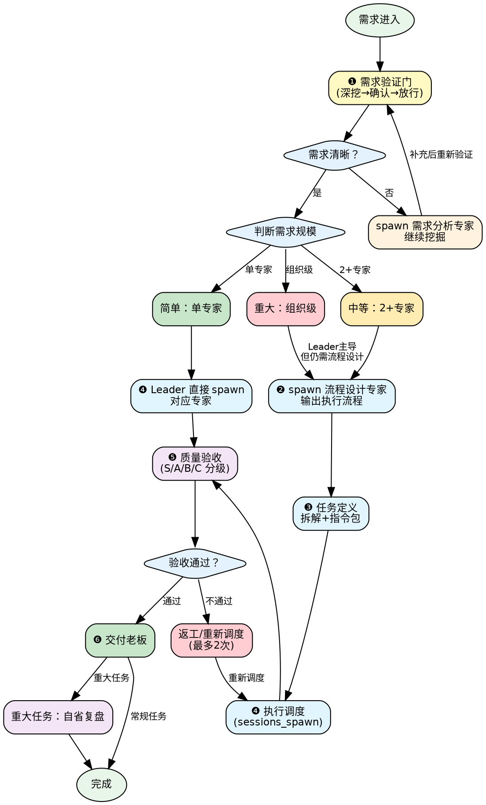

# leader-workflow

> Leader 核心工作流——从需求进门到产出交付的全链路操作手册。

## 模块速查

| 场景 | 加载 | 路径 |
|------|------|------|
| 需求验证门（深挖 + 确认 + 放行） | 📖 | [references/requirement-gate.md](references/requirement-gate.md) |
| 流程设计 + 任务定义 | 📖 | [references/process-and-task.md](references/process-and-task.md) |
| 执行调度（spawn 规范） | 📖 | [references/dispatch.md](references/dispatch.md) |
| 质量验收（分级 + 护栏 + 自省） | 📖 | [references/quality-and-review.md](references/quality-and-review.md) |
| 调度决策模式（串并行判断 + 项目类型 + 错误防范） | 📖 | [references/dispatch-patterns.md](references/dispatch-patterns.md) |

## 工作流概览

```
需求进入 → ❶需求验证门 → ❷流程设计 → ❸任务定义 → ❹执行调度 → ❺质量验收 → ❻交付/自省
```

简单单专家任务可跳过 ❷❸，Leader 直接 spawn。

## 决策流程图



## 铁律
1. **需求验证是 Leader 与老板的直接接口，不能委托**
2. **Leader 不做流程设计** — 有流程设计专家不用 = 外行指挥内行
3. **Leader 只定义目标和验收标准，不写死执行步骤**
4. **所有执行类任务通过 `sessions_spawn` 派发，不自己直接做**
5. **代码类产出必须先过自动验证，未通过不进入人工审查**
