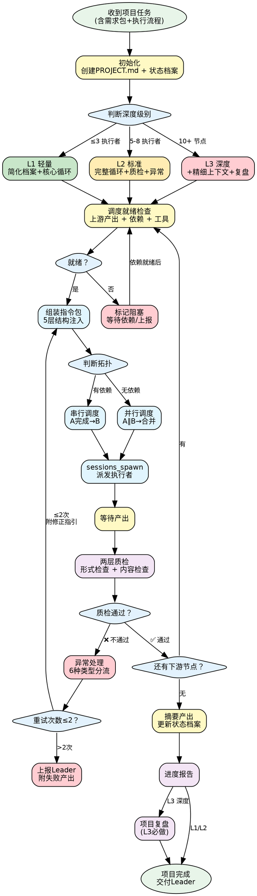

# 项目执行操作手册

> 项目管理专家的核心技能，覆盖项目执行全生命周期：从状态档案建立到复盘收尾。

## 决策流程图

## 模块速查

| 场景 | 加载 | 路径 |
|------|------|------|
| 项目状态档案 + 指令包 + 进度报告 + 复盘模板 | 📖 | references/templates.md |
| 调度决策树 + 质量检查清单 | 📖 | references/checklists.md |
| 6 种异常完整处理步骤 | 📖 | references/troubleshooting.md |
| 上下文管理策略 | 📖 | references/context-strategy.md |
| 执行框架 | 📖 | references/framework.md |
| 调度循环 + 指令包要点 + 质量/异常/上下文速查 | 📖 | references/workflow-and-patterns.md |

## 深度分级

| 级别 | 适用场景 | 说明 |
|------|---------|------|
| L1 轻量 | 单节点、2-3 个执行者 | 简化状态档案，核心调度循环 |
| L2 标准 | 多节点串并行、5-8 个执行者 | 完整调度循环 + 质量检查 + 异常处理 |
| L3 深度 | 复杂项目、10+ 节点 | 完整流程 + 精细上下文管理 + 复盘 |

## 铁律
1. **指令包质量 = 项目质量** — 5 层结构完整注入，验收标准必须可回答"是/否"
2. **不超过 2 次重试** — 解决不了就上报，失败产出不丢弃
3. **你是调度中心不是执行者** — 不自己写代码/文档，拆成指令包派给专家
4. **摘要面向下游** — 核心结论 + 关键数据 + 已知局限，不写流水账
