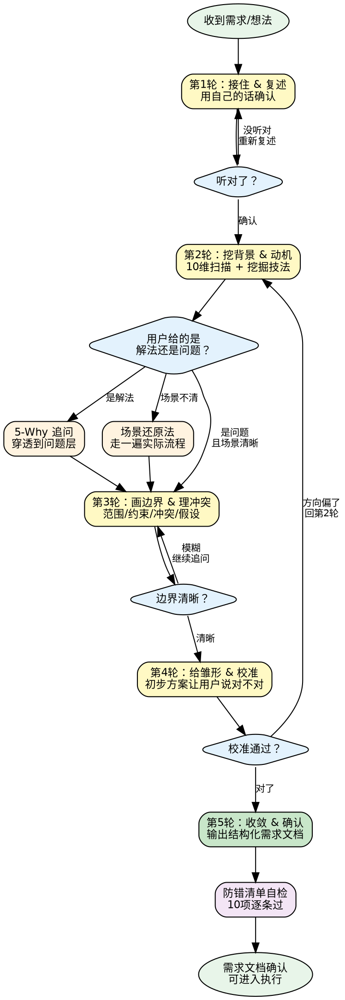

# 需求挖掘全流程

## 决策流程图

## 核心流程：5 轮迭代对话模型

每次需求挖掘遵循 5 轮迭代模型。不是所有需求都需要完整 5 轮——简单需求可以压缩，但**不可跳过第 1 轮和第 5 轮**。

### 第 1 轮：接住 & 复述

**目标**：确认表面需求没有听错。

操作：
1. 认真听用户说完，不打断
2. 用自己的话复述："我理解你是想要……对吗？"
3. 此时**不评价、不建议、不质疑**——纯确认

**关键**：这一步看似简单但极其重要。很多挖掘失败是因为一开始就听错了方向。

### 第 2 轮：挖背景 & 动机

**目标**：从"要什么"穿透到"为什么要"。

操作：
1. 在脑中快速过一遍 **10 维扫描清单**
   → 读 `references/dimension-scan-checklist.md` 获取完整扫描表
2. 识别信息缺失的维度，针对性提问：
   - "你为什么需要这个？现在遇到了什么问题？"
   - "这个需求是谁提出来的？什么场景下需要？"
3. 发现模糊地带后，选用合适的挖掘技法深入
   → 读 `references/deep-mining-techniques.md` 获取 7 大技法

**常用技法组合**：
- 用户给了解法 → 用 **5-Why 追问法** 穿透到问题层
- 需求场景不清 → 用 **场景还原法** 让用户走一遍实际流程
- 怀疑是伪需求 → 用 **反面否定法** 测试必要性

### 第 3 轮：画边界 & 理冲突

**目标**：明确需求的形状和大小。

操作：
1. 明确范围："这个事的范围是什么？哪些不用管？"
2. 找出约束："有什么限制条件？时间/预算/技术/政策？"
3. 排查冲突："跟现在已有的 XX 功能/需求，关系是什么？"
4. 检验假设："你是不是默认了 XX？这个假设我们需要验证一下"

**关键**：没有边界的需求会无限膨胀。约束条件决定了解法空间。

### 第 4 轮：给雏形 & 校准

**目标**：用具体方案检验理解是否准确。

操作：
1. 基于前 3 轮理解，给出一个初步方案框架
2. 用结构化方式呈现："我理解下来，你的需求大概是这样：（1）…（2）…（3）…"
3. 让用户看了说"对 / 不对 / 差一点"
4. 不对 → 回上一步继续挖

**原理**：让用户看方案说"对不对"比让他从零描述高效 100 倍。

### 第 5 轮：收敛 & 确认

**目标**：产出可执行的需求文档。

操作：
1. 把最终需求整理成结构化文档
   → 读 `references/requirement-doc-template.md` 获取标准模板
2. 逐条让用户确认
3. 标注未确认的假设和遗留问题
4. 明确下一步行动

---

## 快速参考：10 维扫描

每次收到需求时，在脑中快速过一遍这 10 个维度，定位信息缺失点：

**WHO** · **WHY** · **WHAT** · **WHEN** · **WHERE** · **HOW** · **边界** · **约束** · **冲突** · **假设**

→ 完整扫描表（含核心问题和常见盲区）：`references/dimension-scan-checklist.md`

---

## 快速参考：7 大挖掘技法

| # | 技法 | 适用场景 |
|---|------|----------|
| 1 | 5-Why 追问法 | 用户给的是解法不是问题，需要纵向穿透 |
| 2 | 场景还原法 | 场景不清，需要横向展开 |
| 3 | 反面否定法 | 怀疑是伪需求，测试必要性 |
| 4 | 极端假设法 | 用户被约束框住，需要突破思维定式 |
| 5 | 对比锚定法 | 用户描述太抽象，需要具象化 |
| 6 | 利益相关者扫描法 | 需要多角色视角，排查诉求冲突 |
| 7 | 拆解投票法 | 需求太多，需要明确优先级 |

→ 每个技法的详细步骤和示例：`references/deep-mining-techniques.md`

---

## 引导技巧

在对话过程中，灵活运用引导技巧提升挖掘效率。

→ 完整引导技巧集（8 条）：`references/advanced-facilitation-tips.md`

---

## 防错清单

每次挖掘结束前，用这个清单自检：

- [ ] 是否穿透了"解法层"找到了"问题层"？
- [ ] 10 维扫描是否每个维度都过了一遍？
- [ ] 是否有未验证的假设？
- [ ] 边界是否清晰（什么做、什么不做）？
- [ ] 约束条件是否已明确？
- [ ] 优先级是否已排序（P0/P1/P2）？
- [ ] 需求之间有没有冲突或依赖没有处理？
- [ ] 验收标准是否每条都可检验、可量化？
- [ ] 用户是否逐条确认了最终需求？
- [ ] 遗留问题是否显式标注了？
