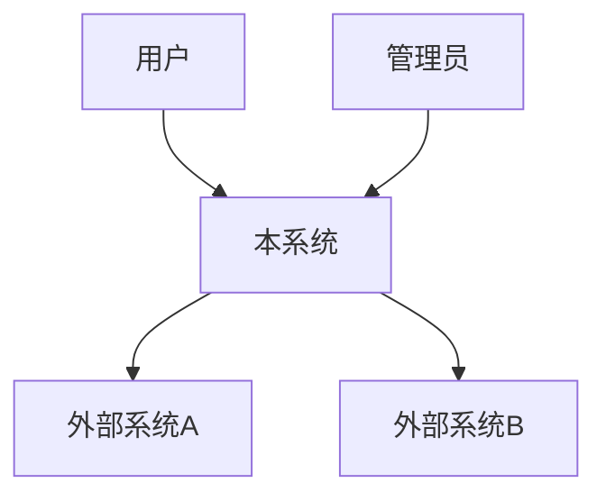
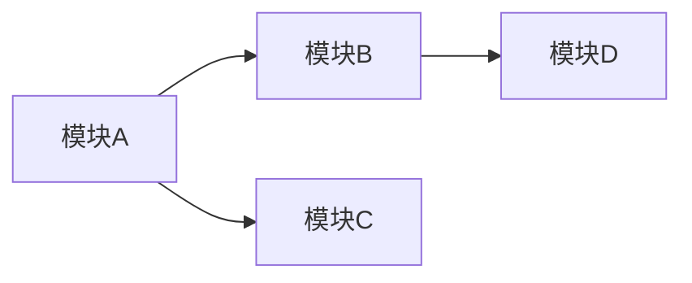

# 架构交付包模板

## 概览

架构交付包包含 7 个标准文档 + ADR 目录：

```
{project}/architecture/
├── architecture-overview.md       # 架构总览
├── system-context.md              # 系统上下文
├── module-boundaries.md           # 模块边界
├── tech-selection-record.md       # 技术选型记录
├── nfr-design.md                  # 非功能性需求设计
├── ai-integration-architecture.md # AI 集成架构
├── reliability-and-security-plan.md # 可靠性与安全方案
└── adr/
    └── ADR-001.md                 # 架构决策记录
```

---

## 1. architecture-overview.md 模板

```markdown
# 架构总览

## 项目信息
- **项目名称**：
- **版本**：v{x.y}
- **日期**：{YYYY-MM-DD}
- **架构负责人**：

## 产品目标摘要
{一段话说清楚这个产品要解决什么问题、为谁解决}

## 架构模式
- **选定模式**：{单体 / 模块化单体 / 微服务 / Serverless / 混合}
- **选择理由**：{为什么这个阶段用这个模式}
- **演进路径**：{当前 → 6个月 → 1年的预期演进方向}

## 系统分层

| 层级 | 职责 | 技术选型 | 说明 |
|------|------|----------|------|
| 接入层 | 流量入口、认证、路由 | | |
| 业务层 | 业务编排、流程控制 | | |
| 领域层 | 核心业务逻辑、领域模型 | | |
| 基础设施层 | 存储、缓存、消息、外部服务 | | |

## 关键技术决策摘要

| 决策 | 选择 | ADR 编号 |
|------|------|----------|
| | | ADR-001 |

## 关键风险

| 风险 | 影响 | 缓解措施 |
|------|------|----------|
| | | |

## 关联文档
- [系统上下文](system-context.md)
- [模块边界](module-boundaries.md)
- [技术选型记录](tech-selection-record.md)
- [NFR 设计](nfr-design.md)
- [AI 集成架构](ai-integration-architecture.md)
- [可靠性与安全方案](reliability-and-security-plan.md)
```

---

## 2. system-context.md 模板

```markdown
# 系统上下文

## 系统上下文图

{用文字或 Mermaid 描述系统与外部的关系}



## 外部系统依赖

| 外部系统 | 交互方式 | 数据流向 | SLA 要求 | 降级方案 |
|----------|---------|---------|---------|---------|
| | REST/gRPC/MQ | 入/出/双向 | | |

## 用户接入方式

| 用户角色 | 接入渠道 | 认证方式 | 并发预估 |
|----------|---------|---------|---------|
| | Web/App/API | | |

## 核心数据流

### 读路径
{描述主要读数据的流向：用户请求 → 接入层 → 缓存/数据库 → 响应}

### 写路径
{描述主要写数据的流向：用户提交 → 接入层 → 业务处理 → 持久化 → 确认}

### 异步流
{描述异步处理流向：事件触发 → 消息队列 → 消费者 → 处理结果}

## 集成点风险评估

| 集成点 | 故障概率 | 影响范围 | 降级策略 |
|--------|---------|---------|---------|
| | 高/中/低 | | |
```

---

## 3. module-boundaries.md 模板

```markdown
# 模块边界

## 模块划分总览

| 模块 | 一句话职责 | 核心实体 | 对外接口 | 依赖模块 |
|------|-----------|---------|---------|---------|
| | | | | |

## 模块详细设计

### 模块：{模块名}

**职责**：{一句话，不出现"和"字}

**核心功能**：
- 

**对外接口**：
| 接口 | 类型 | 调用方 | 说明 |
|------|------|--------|------|
| | 同步/异步/事件 | | |

**数据所有权**：
- 拥有的数据实体：
- 共享的数据（只读引用）：

**依赖关系**：
- 依赖：{列出依赖的模块}
- 被依赖：{列出依赖本模块的模块}

{重复以上结构覆盖所有模块}

## 模块依赖图



## 模块边界检验

| 检验项 | 模块A | 模块B | 模块C |
|--------|-------|-------|-------|
| 独立可部署 | ✅/❌ | | |
| 职责单一 | ✅/❌ | | |
| 依赖方向正确 | ✅/❌ | | |
```

---

## 4. tech-selection-record.md 模板

```markdown
# 技术选型记录

## 选型总览

| 领域 | 选定技术 | 主要理由 | ADR |
|------|---------|---------|-----|
| 前端框架 | | | |
| 后端框架 | | | |
| 数据库 | | | |
| 缓存 | | | |
| 消息队列 | | | |
| 容器/编排 | | | |
| CI/CD | | | |
| 监控 | | | |

## 详细选型记录

### 选型：{领域}

**需求**：{这个领域需要什么能力}

**候选方案**：

| 维度 | 方案A | 方案B | 方案C |
|------|-------|-------|-------|
| 成熟度 | | | |
| 团队熟悉度 | | | |
| 社区活跃度 | | | |
| 性能 | | | |
| 成本 | | | |
| 退出成本 | | | |
| **综合评分** | | | |

**决策**：选择 {方案X}

**理由**：{为什么}

**退出方案**：{如果需要迁移，怎么做}

**关联 ADR**：ADR-{xxx}
```

---

## 5. nfr-design.md 模板

```markdown
# 非功能性需求设计

## 性能目标

| 场景 | 指标 | 目标值 | 当前预估 | 优化策略 |
|------|------|--------|---------|---------|
| 页面首屏加载 | LCP | < 2s | | |
| API 响应 | P95 延迟 | < 200ms | | |
| 并发用户 | 同时在线 | | | |
| 吞吐量 | QPS | | | |

## 扩展策略

| 维度 | 当前方案 | 触发条件 | 扩展方案 |
|------|---------|---------|---------|
| 应用层 | | | |
| 数据层 | | | |
| 缓存层 | | | |

## 安全设计

### 认证与授权
- 认证方式：
- 授权模型：
- Token 策略：

### 数据安全
- 传输加密：
- 存储加密：
- 敏感数据处理：

### 合规要求
| 法规/标准 | 要求 | 实现方式 |
|-----------|------|---------|
| | | |

## 可靠性设计

### SLA 目标
- 可用性目标：
- RTO（恢复时间目标）：
- RPO（恢复点目标）：

### 故障域划分
| 故障域 | 影响范围 | 检测方式 | 恢复方式 |
|--------|---------|---------|---------|
| | | | |

### 监控告警
| 指标 | 告警阈值 | 告警方式 | 响应动作 |
|------|---------|---------|---------|
| | | | |

### 回滚策略
- 代码回滚：
- 数据回滚：
- 配置回滚：
```

---

## 6. ai-integration-architecture.md 模板

```markdown
# AI 集成架构

## AI 能力概览

| AI 能力 | 在系统中的角色 | 模型/服务 | 调用量预估 | 成本预估 |
|---------|-------------|---------|-----------|---------|
| | 核心/辅助 | | | |

## 中间层架构

{描述或绘制 AI 中间��架构图}

### 组件

| 组件 | 职责 | 技术方案 |
|------|------|---------|
| 路由层 | 请求分发到不同模型/服务 | |
| 缓存层 | 相似请求结果复用 | |
| 降级层 | 模型不可用时的兜底 | |
| 监控层 | 成本、延迟、质量监控 | |
| Prompt 管理 | 版本控制、A/B 测试 | |

## 成本控制策略

| 策略 | 实现方式 | 预期效果 |
|------|---------|---------|
| 请求缓存 | | |
| 分级模型 | 简单→小模型，复杂→大模型 | |
| 限流 | | |
| 成本上限 | 日/月成本预算 | |

## 降级方案

| 故障场景 | 降级策略 | 用户感知 |
|----------|---------|---------|
| 模型服务不可用 | | |
| 响应超时 | | |
| 成本超限 | | |
| 内容安全问题 | | |

## Prompt 管理
- 版本控制方式：
- A/B 测试策略：
- 质量评估方式：
```

---

## 7. reliability-and-security-plan.md 模板

```markdown
# 可靠性与安全方案

## 可靠性方案

### 高可用架构
- 部署模式：{单节点 / 主备 / 多活}
- 负载均衡策略：
- 健康检查机制：

### 容灾设计
- 容灾级别：{同城 / 异地 / 多云}
- 数据备份策略：{频率、保留周期、验证方式}
- 故障切换机制：{自动/手动、切换时间}

### 降级策略

| 服务 | 降级触发条件 | 降级行为 | 恢复条件 |
|------|-------------|---------|---------|
| | | | |

### 监控告警体系

| 层级 | 监控内容 | 工具 | 告警方式 |
|------|---------|------|---------|
| 基础设施 | CPU/内存/磁盘/网络 | | |
| 应用层 | 错误率/延迟/QPS | | |
| 业务层 | 关键业务指标 | | |

## 安全方案

### 威胁模型

| 威胁 | 攻击路径 | 影响 | 防护措施 |
|------|---------|------|---------|
| | | | |

### 安全架构分层

| 层级 | 安全措施 |
|------|---------|
| 网络层 | 防火墙、WAF、DDoS 防护 |
| 应用层 | 输入验证、CSRF/XSS 防护、限流 |
| 数据层 | 加密存储、脱敏、访问控制 |
| 运维层 | 审计日志、密钥管理、最小权限 |

### 合规检查清单

| 合规要求 | 状态 | 负责方 | 说明 |
|----------|------|--------|------|
| | ✅/❌/🔲 | | |
```

---

## 8. ADR 完整模板

```markdown
# ADR-{序号}: {决策标题}

## 状态
{Proposed | Accepted | Deprecated | Superseded by ADR-xxx}

## 日期
{YYYY-MM-DD}

## 背景
{什么问题需要决策？当前约束是什么？触发这个决策的原因是什么？}

## 决策
{选择了什么方案？用一两句话说清楚。}

## 理由
{为什么选这个方案？核心论据是什么？}

## 考虑的替代方案

### 方案 A：{名称}（选中）
- **描述**：
- **优势**：
- **劣势**：
- **退出成本**：{低/中/高} — {具体说明}

### 方案 B：{名称}
- **描述**：
- **优势**：
- **劣势**：
- **退出成本**：{低/中/高} — {具体说明}

### 方案 C：{名称}（如有）
- **描述**：
- **优势**：
- **劣势**：
- **退出成本**：{低/中/高} — {具体说明}

## 后果

### 正面
- 

### 负面
- 

### 风险缓解
- 

## 关联
- **影响文档**：{列出受影响的架构文档}
- **关联 ADR**：{列出相关的 ADR}
- **利益相关方**：{谁需要知道这个决策}

## 评审记录
| 评审人 | 日期 | 意见 |
|--------|------|------|
| | | |
```

---

## 轻量版模板（快速评估用）

```markdown
# 架构评估简报

## 基本信息
- **项目/功能**：
- **日期**：
- **评估人**：

## 产品目标
{一段话}

## 推荐架构方案
- **架构模式**：
- **核心技术选型**：
- **选择理由**：

## 关键风险
| 风险 | 影响 | 缓解措施 |
|------|------|----------|
| | | |

## 技术约束
- 

## 后续行动
| 行动 | 负责方 | 优先级 |
|------|--------|--------|
| | | |

## 备注
{需要进一步细化的方面}
```
